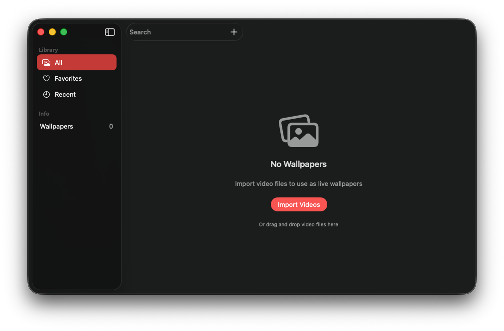
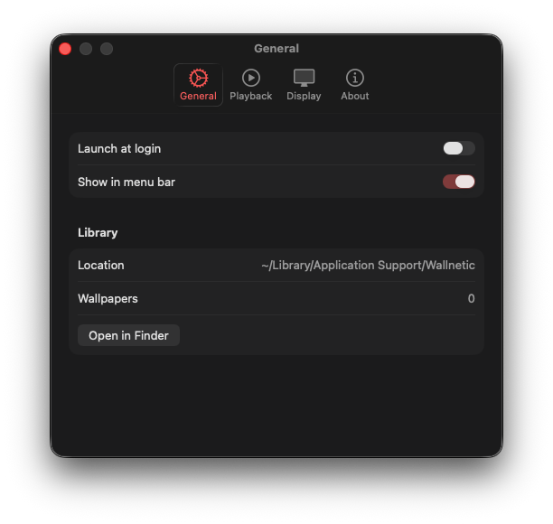

# Wallnetic

> **AI-Powered Live Wallpaper Engine for macOS**

[](https://www.apple.com/macos/)
[](https://swift.org/)
[](https://developer.apple.com/xcode/swiftui/)
[](https://developer.apple.com/metal/)
[](LICENSE)
[](https://apps.apple.com)

<p align="center">
  
</p>

## What is Wallnetic?

Wallnetic brings **live video wallpapers** to your Mac desktop. Transform your workspace with dynamic, animated backgrounds that run efficiently in the background.

**Wallpaper Engine** has 40M+ users on Windows - now Mac users finally have a native alternative!

---

## Features

### Live Video Wallpapers
- Play any video file (MP4, MOV, HEVC) as your desktop background
- Smooth looping with no stuttering
- Works on all your displays simultaneously

### Multi-Monitor Support
- Set different wallpapers for each display
- Automatic screen detection
- Per-display wallpaper management

### Smart Power Management
- Auto-pause when on battery power
- Pause when fullscreen apps are active
- Resume automatically when conditions change

### Optimized Performance
- **Metal GPU acceleration** for smooth playback
- Minimal CPU usage (~2-5%)
- Memory-efficient design
- Runs silently in the background

### Native macOS Experience
- Built with SwiftUI
- Menu bar app for quick access
- Keyboard shortcuts
- Launch at login

---

## Screenshots

<p align="center">
  
</p>

<p align="center">
  
</p>

---

## Installation

### Requirements
- macOS 13.0 (Ventura) or later
- Apple Silicon (M1/M2/M3) or Intel Mac

### Download

| Version | Download |
|---------|----------|
| v1.0.0 | [Coming Soon on App Store](#) |

### Build from Source

```bash
# Clone the repository
git clone https://github.com/fatihkan/wallnetic.git
cd wallnetic

# Open in Xcode
open src/Wallnetic/Wallnetic.xcodeproj

# Build and run (⌘ + R)
```

---

## Tech Stack

| Component | Technology |
|-----------|------------|
| Language | Swift 5.9+ |
| UI Framework | SwiftUI |
| Video Engine | AVFoundation |
| GPU Rendering | Metal |
| Architecture | MVVM |

---

## Roadmap

### Phase 1: MVP - Live Wallpapers
- [x] Video playback engine
- [x] Multi-monitor support
- [x] Menu bar app
- [x] Power management
- [x] Metal rendering
- [x] App Store submission

### Phase 2: AI Integration (Coming Soon)
- [ ] Generate wallpapers from text prompts
- [ ] Photo-to-wallpaper AI transformation
- [ ] Multiple style options (Anime, Abstract, etc.)

### Phase 3: Motion & Effects
- [ ] AI video generation
- [ ] Particle effects
- [ ] Audio-reactive animations

See [ROADMAP.md](docs/ROADMAP.md) for the full development plan.

---

## Project Structure

```
wallnetic/
├── src/Wallnetic/           # Xcode project
│   ├── App/                 # App entry & delegate
│   ├── Engine/              # Video rendering engine
│   │   ├── VideoRenderer.swift
│   │   ├── MetalVideoRenderer.swift
│   │   ├── DesktopWindowController.swift
│   │   └── PowerManager.swift
│   ├── Views/               # SwiftUI views
│   ├── Services/            # Business logic
│   └── Models/              # Data models
├── docs/                    # Documentation
└── README.md
```

---

## Contributing

Contributions are welcome! Please feel free to submit a Pull Request.

1. Fork the repository
2. Create your feature branch (`git checkout -b feature/amazing-feature`)
3. Commit your changes (`git commit -m 'Add amazing feature'`)
4. Push to the branch (`git push origin feature/amazing-feature`)
5. Open a Pull Request

---

## Support

If you find this project useful, consider supporting its development:

<a href="https://buymeacoffee.com/fatihkan" target="_blank">
  
</a>

---

## Author

**Fatih Kan**

- Twitter: [@pariloapp](https://twitter.com/pariloapp)
- GitHub: [@fatihkan](https://github.com/fatihkan)
- LinkedIn: [Fatih Kan](https://linkedin.com/in/fatihkan)

---

## License

This project is licensed under the MIT License - see the [LICENSE](LICENSE) file for details.

---

<p align="center">
  Made with ❤️ for Mac users who deserve better wallpapers
</p>
